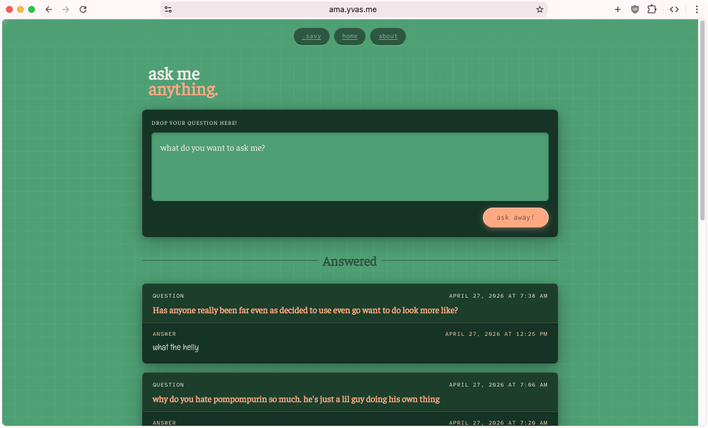

# ama-dot-me



A smol website for "ask-me-anything" questions built using [AHA Stack](https://ahastack.dev/)

check it out at [ama.yvas.me](https://ama.yvas.me)

## How it Works?

someone asks a question anonymously through the form on the site. the question gets saved to a D1 database and an email with the question as the body lands in my inbox via [Resend](https://resend.dev).

answering is just replying to that email. a standalone Cloudflare Worker listens on the reply address via [CF Email Routing](https://www.cloudflare.com/en-gb/developer-platform/products/email-routing/), parses the reply, strips the quoted original, and updates the database row to mark it as published.

```
question submitted
      ↓
saved to D1 (unpublished)
      ↓
notification email to your inbox (via Resend)
      ↓
you reply to the notif. email
      ↓
cf routes the email to the email worker
      ↓
answer extracted, row in database is updated and the answer published
      ↓
question appears on the site
```

## Stack

built on the [AHA Stack](https://ahastack.dev/) (Astro + htmx + Alpine.js) with a few extras:

| layer | tech |
| :--- | :--- |
| framework | [Astro](https://astro.build) (SSR, CF Workers adapter) |
| API | [Hono](https://hono.dev) (mounted inside Astro at `/api/*`) |
| database | [Cloudflare D1](https://www.cloudflare.com/en-gb/developer-platform/products/d1/) (SQLite at the edge) |
| ORM | [Drizzle](https://orm.drizzle.team) |
| email outbound | [Resend](https://resend.dev) |
| email inbound | [CF Email Routing](https://www.cloudflare.com/en-gb/developer-platform/products/email-routing/) → standalone CF Worker |
| spam filtering | Cloudflare Turnstile |
| OG images | [workers-og](https://npmx.dev/package/workers-og) (satori + resvg-wasm) |
| deployment | [Cloudflare Workers](https://www.cloudflare.com/en-gb/developer-platform/products/workers/) |

## Scripts

all commands are run from the root of the project:

| command | action |
| :--- | :--- |
| `pnpm install` | installs dependencies |
| `pnpm dev` | starts local dev server at `localhost:4321` |
| `pnpm build` | builds production site to `./dist/` |
| `pnpm preview` | builds and previews locally via wrangler |
| `pnpm deploy` | builds and deploys to Cloudflare Workers |
| `pnpm deploy:email` | deploys the email inbound worker |
| `pnpm gen:types` | generates CF Worker types from `wrangler.toml` |
| `pnpm gen:types:email` | generates types for the email worker |
| `pnpm gen:migrations` | generates Drizzle migration SQL |
| `pnpm gen:favicon` | converts `favicon.svg` to `favicon.ico` |
| `pnpm db:migrate` | applies migrations to local D1 |
| `pnpm db:migrate:prod` | applies migrations to remote D1 |
| `pnpm db:studio:local` | opens Drizzle Studio against local D1 |
| `pnpm fmt` | formats and lints with Biome |
